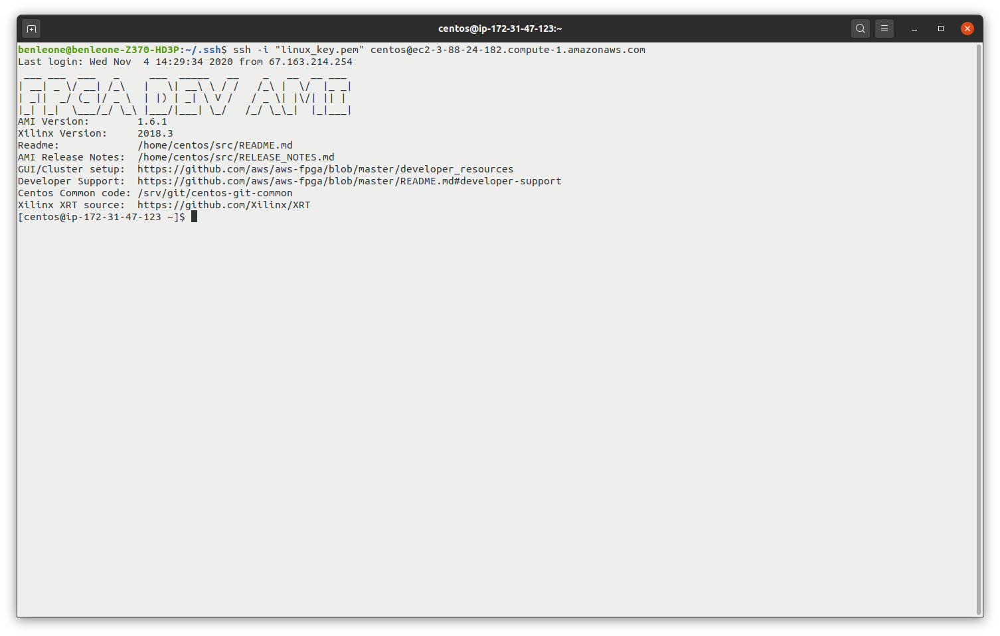
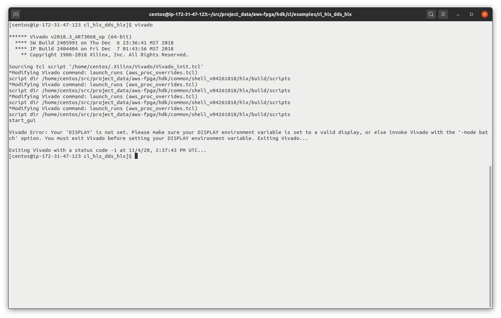
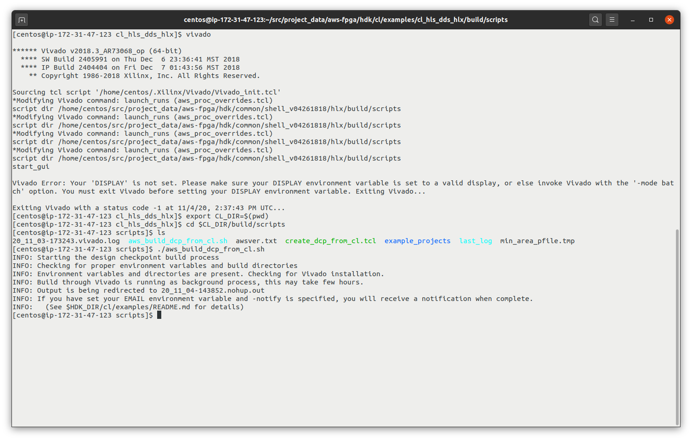
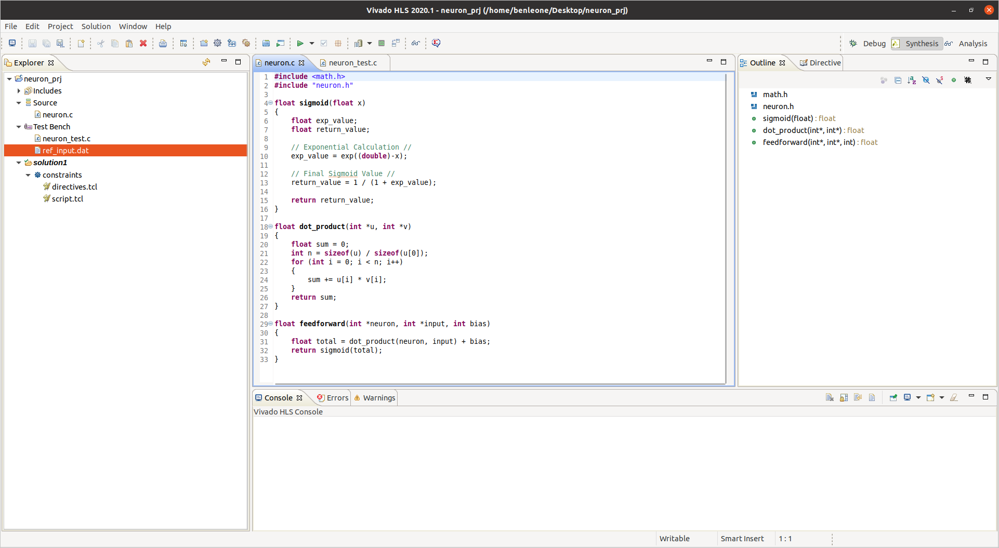
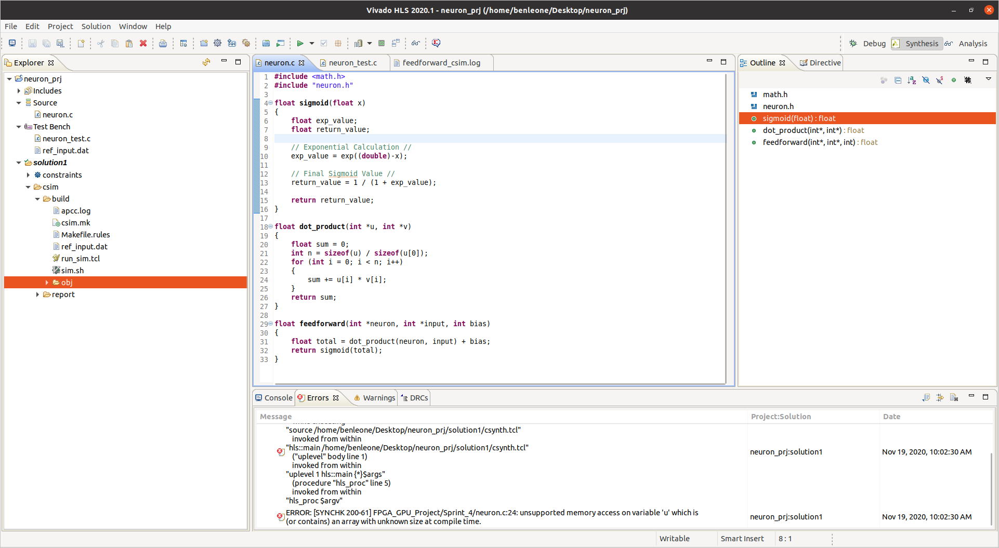

# EC601 Project - FPGA vs. GPU for Machine Learning

## Product Mission

To compare and benchmark FPGA vs GPU execution speed on cloud platforms especially for machine learning purposes. Additionally, try to evalute if FPGAs will overtake GPUs for specific machine learning tasks.

## Minimum Viable Product (MVP)

The minimum viable product is a simple machine learning algorithm that can be executed on both FPGAs and GPUs and to compare and evaluate their execution time, performance and power consumption.

## User Stories

- A machine learning developer wants to develop an application that requires a fast execution speed and needs to decide between FPGA and GPU.
- A machine learning developer wants to verify the performance of a particular cloud computing service that supports tensorflow frameworks

## Technologies to evaluate and reason for choosing

Framework

- Tensorflow: open source, developed and used by Google, wide range of tutorials, documentation and support
- Platform - Amazon Web Services for it's familiarity and support
- EC2 F1 instances
- Sagemaker
- Boston University Shared Compute Cluster (SCC)

## [Sprint 1](https://github.com/benleone90/FPGA_GPU_Project/blob/main/Sprint_1/FPGA%20vs.%20GPU%20-%20Sprint%201.pdf)

### Product Mission

- Our product will be designed to analyze and compare FPGA and GPU performance in machine learning applications
- Some ML applications that can be helpful:
  - Basic image processing
  - Language recognition
  - Text-to-speech
- Additionally, see how effective High Level Synthesis is at implementing code in hardware description language (HDL)

### Design MVP and User Stories

**MVP**

- A repeatable ML model that can be run on various technologies to analyze how performance changes for GPU vs FPGA

**User Stories**

- A machine learning application developer wants to develop an application that requires a fast execution speed and needs to decide between using an FPGA or GPU
- A developer wants to verify the performance of a particular cloud computing service that supports tensorflow frameworks
- A student new to machine learning wants to use FPGAs but is unfamiliar with HDL and needs to use high-level languages

### Evaluating Technologies for Machine Learning

- AWS

  - F1 - FPGA instances in the cloud
  - Hello world examples
  - Demonstrate an example application written in C that is synthesized to RTL (Verilog)

- Sagemaker - build, create, and deploy ML models in the cloud
- TensorFlow
- Keras (was separate but now fully integrated)
- ML5.js - aims to make machine learning approachable for a broad audience
- PyTorch - computer vision and NLP library developed by Facebook AI Research (FAIR) Lab
- Others that are relevant

## Sprint 2

### Phase 1 - AWS EC2 F1 'Hello, World!' Example

**Figure 1: AWS EC2 F1 Flow Chart - How It Works**

**Figure 2: AWS Console - Selecting an Amazon Machine Image (AMI)**

**Figure 3: AWS Console - Launching AMI Image**

**Figure 4: Connecting to the F1 Instance via SSH**

**Figure 5: AWS - Create S3 bucket to hold log and synthesis files**

**Figure 6: AWS CLI - Successful synthesis of combinational logic**

**Figure 7: AWS CLI - FPGA Image is successfully created**

**Figure 8: AWS CLI - Create AFI for synthesis on FPGA**

**Figure 9: AWS - Connect to FPGA Instance**

**Figure 10: AWS CLI - Clear, load, and verify FPGA**

**Figure 11: AWS CLI - Testing Hello, World!**

**Issues**

~~10/18/2020 - FPGA instances no longer appear as an option on AWS EC2 F1 Instances~~

### Phase 2 - Create a machine learning neuron

Create a machine learning neuron that demonstrates how data is taken in, maninpulated and biased and output for future manipulation or output to the user.
_See [phase2_neuron.py](https://github.com/benleone90/FPGA_GPU_Project/blob/main/Sprint_2/phase2_neuron.py)_

## Sprint 3

### Goal

Deploy a similar machine learning algorithm on FPGA and GPU platforms. Referencing [freeCodeCamp - How to Benchmark Machine Learning Execution Speed](https://www.freecodecamp.org/news/benchmarking-machine-learning-execution-speeds/) to find a best practice on how to get these benchmarks running.

### Phase 1 - Create Neural Network Neuron in C

See [neuron.c](https://github.com/benleone90/FPGA_GPU_Project/blob/main/Sprint_3/neuron.c) which contains an interpretation of the Python code used in Sprint 2 into C.

### Phase 2 - Implement C to HDL Example

**Figure 1: Remote into AWS F1 Instance**

**Figure 2: Lauching Vivado GUI - Failure to lauch GUI due to no DISPLAY env variable being set**

**Figure 3: Building Design Check Point (DCP) from Custom Logic**

**Issues**

11/3/2020 - Vivado GUI giving errors to not launch because no DISPLAY env variable is set

## Sprint 4

### Goal

Create a neural network in C from the neuron code that was presented in Sprint 3. The code can be seen in [`network.c`](https://github.com/benleone90/FPGA_GPU_Project/blob/main/Sprint_4/network.c).

Implement the [`neuron.c`](https://github.com/benleone90/FPGA_GPU_Project/blob/main/Sprint_4/neuron.c) code with a testbench into Vivado HLS to then be used on AWS F1. We aimed to compare these results to the SCC results.

**Figure 1: Vivado HLS Project with neuron.c**

**Figure 2: Vivado HLS Synthesis with Warnings Regarding the Build**

## Sprint 5

### Goal

Finalize design for neural network and build the HLS design to be used on AWS and SCC.
